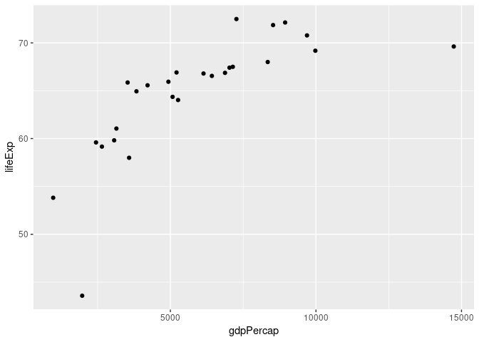
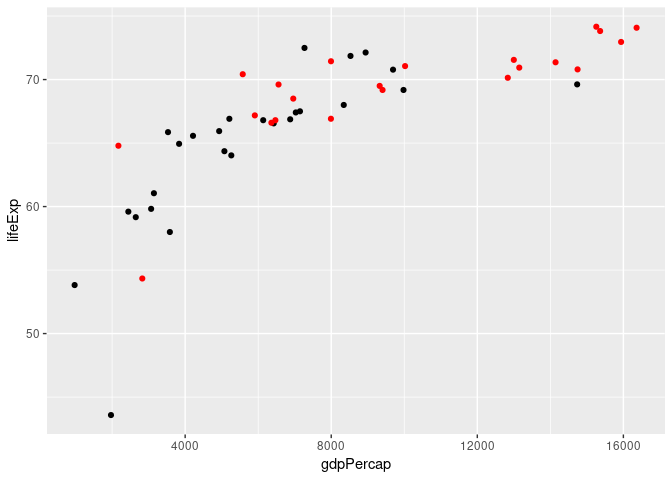

Gapminder Exercise Template
================
Bora Jin
2018-08-21

## Load packages

``` r
library(tidyverse)
```

## Load data

``` r
gap = read_csv("https://bit.ly/gap_data")
```

## Exercises

### Exercise 1

How many observations are in this dataset?

There are 1363 observations in the dataset.

### Exercise 2

Visualize the relationship between GDP and life expectancy for countries
in Europe in 1952 using a scatter plot.

<!-- -->

### Exercise 3

Add year 1967 in another color.

<!-- -->
